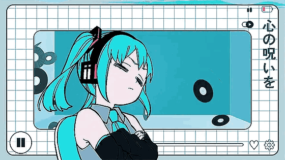
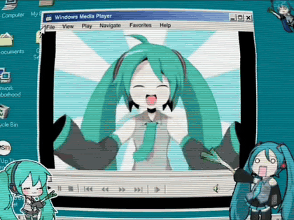

# Mikael Muniz

**`software engineer`** · são paulo, br

 

I build things in **TypeScript** — React and Next.js on the front, Node and
NestJS on the back — and reach for **Go** when it has to be small and fast, or
**Java** when the job calls for it. Based in São Paulo.

 

### ♪ stack

 

### ♪ projects

| | | |
|:--|:--|:--|
| [**elagix-tk**](https://github.com/mkmuniz/elagix-tk) | Rust | Cuts token waste in coding-agent sessions — a `$PATH` shim for shell commands, a JSON-RPC proxy for MCP tools, extractive summarisation for prose |
| [**mira-discord-bot**](https://github.com/mkmuniz/mira-discord-bot) | TypeScript | Mira, a matchmaking bot for Discord — discord.js + Prisma |
| [**bastion**](https://github.com/thewaifucorp/bastion-agent) `★7` | Rust · *contributor* | An agent for your whole life: contestable memory, explicit authority, user-owned data. 29 merged PRs across [`bastion-agent`](https://github.com/thewaifucorp/bastion-agent/pulls?q=is%3Apr+author%3Amkmuniz) and [`bastion-core`](https://github.com/thewaifucorp/bastion-core/pulls?q=is%3Apr+author%3Amkmuniz) |

 

### ♪ now playing

<table>
<tr>
<td width="440">

</td>
<td valign="top">

<!-- preenchido sozinho todo dia pelo workflow .github/workflows/waka-readme.yml -->
<!--START_SECTION:waka-->
<!--END_SECTION:waka-->

</td>
</tr>
</table>

 

artwork by unknown artists, found via Pinterest — happy to credit properly if you know the source

