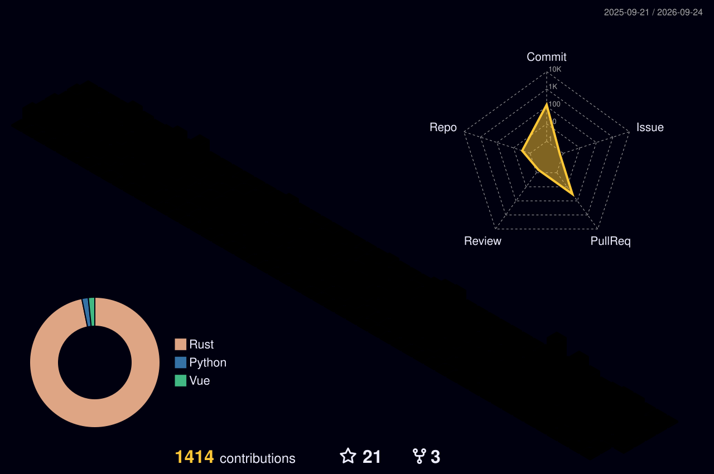

<div align="center">
  
</div>

<table>
<tr>
<td width="250" align="center">
  
</td>
<td>
<pre>
       mikael@github
       ────────────────────────────────────
       OS         macOS · darwin 24.6
       Shell      zsh
       Editor     VS Code
       Langs      TypeScript · Go · Java
       Repos      81 public
       Location   São Paulo, BR
       Wired to   Lain · Miku · Ellen Joe
       Avatar     rendered by ./tools/render.py

       ███ ███ ███ ███ ███ ███
</pre>
</td>
</tr>
</table>

<div align="center">

[](https://mkmuniz.dev)
[](https://www.linkedin.com/in/mikael-muniz-ribeiro/)
[](mailto:mikaelmuniz2001@gmail.com)
[](https://linktr.ee/mkmuniz)

</div>

---

<details open>
<summary><code>$ whoami</code></summary>

<br>

Software engineer in São Paulo. I spend most of my time in **TypeScript** —
React and Next.js on the front, Node and NestJS on the back — and reach for
**Go** when something has to be small and fast, or **Java** when the expedition
calls for it.

Everything on this profile is generated by scripts that live in this repo. The
avatar is not a screenshot and not a skin-render API: it is drawn pixel by pixel
and raytraced by ~250 lines of NumPy. Open the `$ cat tools/render.py` panel
below if you want the details.

> `PRESENT DAY` &nbsp;&nbsp; `PRESENT TIME` — the palette here is a nod to
> *Serial Experiments Lain*'s CRT dread, Miku's teal and Ellen Joe's cold blue.

</details>

<details>
<summary><code>$ ls ~/stack</code></summary>

<br>

<div align="center">
  
  <br>
  
  <br>
  
</div>

<br>

| Slot | Item | Durability |
|:--|:--|:--|
| `1` | **TypeScript** — main tool, never leaves the hotbar | `⣿⣿⣿⣿⣿⣿⣿⣿⣿⣿` |
| `2` | **React / Next.js** — where most of the UI work lands | `⣿⣿⣿⣿⣿⣿⣿⣿⣦⣀` |
| `3` | **Node / NestJS** — APIs and services | `⣿⣿⣿⣿⣿⣿⣿⣦⣀⣀` |
| `4` | **Go** — when it has to be small and fast | `⣿⣿⣿⣿⣿⣶⣀⣀⣀⣀` |
| `5` | **Java** — enterprise expeditions | `⣿⣿⣿⣿⣶⣀⣀⣀⣀⣀` |
| `6` | **Docker** — everything ships in a box | `⣿⣿⣿⣿⣿⣿⣦⣀⣀⣀` |

</details>

<details>
<summary><code>$ gh repo list --sort=stars</code></summary>

<br>

| Project | Stack | What it is |
|:--|:--|:--|
| [**BrightFlow**](https://github.com/mkmuniz/BrightFlow) `★7` | TypeScript | Dashboard for managing energy-bill data |
| [**FastPix**](https://github.com/mkmuniz/FastPix) `★7` | Java | Generating and managing Pix payments |
| [**Mikael-Portfolio**](https://github.com/mkmuniz/Mikael-Portfolio) | Vue | Projects and career, in one place |
| [**FinTrack**](https://github.com/mkmuniz/FinTrack) | Go | Personal finance tracking |
| [**mira-discord-bot**](https://github.com/mkmuniz/mira-discord-bot) | TypeScript | Discord bot |
| [**elagix-tk**](https://github.com/mkmuniz/elagix-tk) | Rust | Toolkit experiments |

</details>

<details>
<summary><code>$ wakatime --last-30-days</code></summary>

<br>

<!-- preenchido sozinho todo dia pelo workflow .github/workflows/waka-readme.yml -->
<!--START_SECTION:waka-->
<!--END_SECTION:waka-->

</details>

<details>
<summary><code>$ cat tools/render.py</code></summary>

<br>


Three files, no external service:

```
tools/skin.py     →  assets/mkmuniz-skin.png   64×64, a real Minecraft skin
tools/render.py   →  assets/mkmuniz-3d.gif     36 frames, 360° turnaround
tools/header.py   →  assets/header.svg         the animated banner up top
```

**`skin.py`** draws every face of the character as text. No image editor — the
hoodie, the headphones and the diamond on the chest are literally typed out:

```python
"front": ["HHHHHHHH", "HHHHHHHH", "HSSSSSSH", "SSSSSSSS",
          "SEPSSPES", "SSSSSSSS", "SSSMMSSS", "SSSSSSSS"],
```

**`render.py`** is a tiny 3D renderer — no engine, no WebGL, ~250 lines of
NumPy. It shoots an orthographic ray per pixel at the eight oriented boxes that
make up the body, samples the skin with Minecraft's own UV layout, quantises the
lighting into six steps, and writes a transparent GIF that reads correctly on
both the light and the dark GitHub theme.

**`header.py`** emits the banner as SMIL-animated SVG. GitHub strips `<script>`,
`<style>` and every `style=` attribute from a README, so the scanlines, the
chromatic aberration and the CRT sweep are all plain `<animate>` elements.

```bash
pip install -r tools/requirements.txt
python tools/render.py   # regenerates all three files above
python tools/header.py
```

Change a letter in `skin.py`, re-run, and the character changes.

<br clear="right">

</details>

---

<div align="center">
  
</div>
