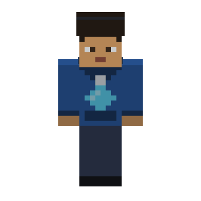
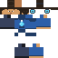

<div align="center">



# Mikael Muniz Ribeiro

<a href="https://readme-typing-svg.demolab.com/">
  
</a>

<br>

[](https://mkmuniz.dev)
[](https://www.linkedin.com/in/mikael-muniz-ribeiro/)
[](mailto:mikaelmuniz2001@gmail.com)
[](https://linktr.ee/mkmuniz)

</div>

---

## 🎒 Inventory

<div align="center">


<br>

<br>


</div>

| Slot | Item | Durability |
|:--|:--|:--|
| `1` | **TypeScript** — main tool, never leaves the hotbar | ████████████ |
| `2` | **React / Next.js** — where most of the UI work lands | ██████████░░ |
| `3` | **Node / NestJS** — APIs and services | █████████░░░ |
| `4` | **Go** — when it has to be small and fast | ███████░░░░░ |
| `5` | **Java** — enterprise expeditions | ██████░░░░░░ |
| `6` | **Docker** — everything ships in a box | ████████░░░░ |

---

## 📊 Stats

<div align="center">


<br>


</div>

---

## ⏱️ Time played

<!-- preenchido sozinho todo dia pelo workflow .github/workflows/waka-readme.yml -->
<!--START_SECTION:waka-->
<!--END_SECTION:waka-->

---

## 🌍 Biomes explored

| Project | Stack | What it is |
|:--|:--|:--|
| [**BrightFlow**](https://github.com/mkmuniz/BrightFlow) ⭐7 | TypeScript | Dashboard for managing energy-bill data |
| [**FastPix**](https://github.com/mkmuniz/FastPix) ⭐7 | Java | Generating and managing Pix payments |
| [**Mikael-Portfolio**](https://github.com/mkmuniz/Mikael-Portfolio) | Vue | Projects and career, in one place |
| [**FinTrack**](https://github.com/mkmuniz/FinTrack) | Go | Personal finance tracking |
| [**mira-discord-bot**](https://github.com/mkmuniz/mira-discord-bot) | TypeScript | Discord bot |
| [**elagix-tk**](https://github.com/mkmuniz/elagix-tk) | Rust | Toolkit experiments |

---

## 🔨 Crafting recipe

That avatar up there is not a screenshot, and it is not a skin-render API. It is
built twice from scratch, by two scripts living in this repo:

```
tools/skin.py     →  assets/mkmuniz-skin.png   64×64, a real Minecraft skin
tools/render.py   →  assets/mkmuniz-3d.gif     36 frames, 360° turnaround
```

**`skin.py`** draws every face of the character as text. No image editor — the
hoodie, the headphones and the diamond on the chest are literally typed out:

```python
"front": ["HHHHHHHH", "HHHHHHHH", "HSSSSSSH", "SSSSSSSS",
          "SEPSSPES", "SSSSSSSS", "SSSMMSSS", "SSSSSSSS"],
```

**`render.py`** is a tiny 3D renderer — no engine, no WebGL, ~250 lines of
NumPy. It shoots an orthographic ray per pixel at the eight oriented boxes that
make up the body, samples the skin with Minecraft's own UV layout, quantises the
lighting into six steps, and writes a transparent GIF that reads correctly on
both the light and the dark GitHub theme.

Rebuild it yourself:

```bash
pip install -r tools/requirements.txt
python tools/render.py   # regenerates all three files above
```

Change a letter in `skin.py`, re-run, and the character changes. 🙂

<div align="center">
<br>

<br>
<sub><i>the raw 64×64 texture — every pixel typed by hand</i></sub>
</div>
